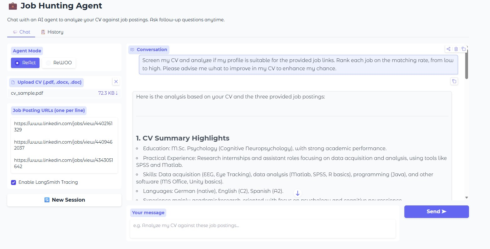
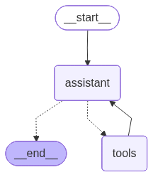
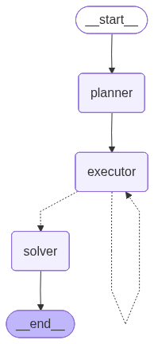

# Job Hunting Agent

**Author:** Chong Kiat Lim

An AI-powered career assistant that analyzes your CV against job postings and provides tailored recommendations. Built with LangChain, LangGraph, and OpenAI.

## Features

- **Two agent architectures**: ReAct (iterative reasoning) and ReWOO (plan-then-execute)
- **Chatbot-style GUI**: Multi-turn conversation with memory, follow-up questions, and session management
- **CV parsing**: Supports `.pdf`, `.docx`, and `.doc` formats
- **Job scraping**: Extracts structured details from job posting URLs via OpenAI web search
- **Dual interface**: CLI (interactive + scripted) and Gradio web UI
- **Conversation history**: View and export previous conversations
- **LangSmith tracing**: Optional observability — auto-detected from `.env`, toggle on/off in GUI and CLI

## Screenshot



## Agent Graphs

| ReAct | ReWOO |
|:-----:|:-----:|
|  |  |

## Quick Start

### 1. Setup

```bash
python -m venv .venv
.\.venv\Scripts\activate      # Windows
pip install -r requirements.txt
```

### 2. Configure API Keys

Create a `.env` file:

```
OPENAI_API_KEY=sk-...

# Optional: LangSmith tracing (if not provided, tracing is disabled automatically)
LANGCHAIN_API_KEY=lsv2_...
LANGSMITH_API_KEY=lsv2_...
LANGSMITH_PROJECT=Job Hunting Agent
```

### 3. Run

**Web UI:**
```bash
python main.py gui
```

**CLI (interactive):**
```bash
python main.py
```

**CLI (scripted):**
```bash
python main.py --mode react --cv data/cv_sample.pdf --jobs https://linkedin.com/jobs/view/123 https://linkedin.com/jobs/view/456 --langsmith
```

## Project Structure

```
├── main.py                # Entry point
├── app/
│   ├── tools.py           # CV reader & job scraper tools
│   ├── react_agent.py     # ReAct agent
│   ├── rewoo_agent.py     # ReWOO agent
│   ├── cli.py             # Command-line interface
│   └── gui.py             # Gradio chatbot web interface
├── tests/                 # Unit tests (pytest)
├── data/                  # Sample CV files
├── documents/images/      # Screenshots
├── .env                   # API keys (not committed)
└── requirements.txt
```

## Testing

Unit tests use **pytest** with `unittest.mock` to isolate components from external dependencies (OpenAI API, file system).

```bash
pytest tests/ -v
```

| Test Module | Coverage |
|-------------|----------|
| `test_tools.py` | CV extraction (PDF, DOCX, multi-page), unsupported formats, file-not-found errors, job scraper invocation |
| `test_react_agent.py` | Graph compilation, agent invocation, multi-link message passing |
| `test_rewoo_agent.py` | Graph compilation, plan regex parsing, agent invocation, task construction with job links |

## Documentation

- [IMPLEMENTATION.md](documents/IMPLEMENTATION.md) — Architecture and component details
- [USAGE.md](documents/USAGE.md) — Full usage guide with examples and troubleshooting

## Tech Stack

| Skill | Description |
|-------|-------------|
| LangChain | LLM orchestration framework for tool integration and prompt management |
| LangGraph | Stateful agent graph construction with conditional edges and cycles |
| ReAct Pattern | Iterative reasoning-and-acting loop where the LLM decides next steps based on observations |
| ReWOO Pattern | Plan-then-execute architecture that generates a full plan before tool execution |
| OpenAI GPT-4o | Large language model for reasoning, analysis, and content generation |
| OpenAI Web Search | Real-time web browsing via `gpt-4o-search-preview` to extract live job posting data |
| Tool Use / Function Calling | LLM-driven tool selection and invocation with structured inputs/outputs |
| Multi-Agent Graph Design | Separate planner, executor, and solver nodes with state passing |
| Conversation Memory | Thread-based persistence using `InMemorySaver` for multi-turn interactions |
| Prompt Engineering | System prompts guiding agent behavior, output format, and task decomposition |
| LangSmith Tracing | Observability and debugging of LLM calls, tool usage, and agent trajectories |
| Gradio | Interactive chatbot web UI with file upload, session management, and history export |
| Document Parsing | CV extraction from PDF/DOCX/DOC using pdfplumber and python-docx |
| Agentic AI Architecture | End-to-end design of autonomous AI agents that reason, plan, and act |
